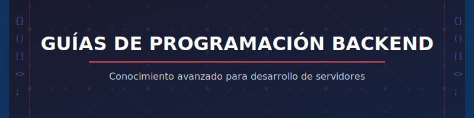

# Guías de Programación Backend

  

---

  <h3>Colección refinada de recursos para el desarrollo backend</h3>

---

## Índice

- [Introducción](#introducción)
- [Estructura](#estructura)
- [Implementación](#implementación)
- [Contribuciones](#contribuciones)

---

## Introducción

Bienvenido a esta recopilación meticulosamente curada de guías de programación backend. Este repositorio ha sido diseñado con el propósito de facilitar el acceso a conocimientos avanzados y fundamentales en el desarrollo de la capa de servidor.

## Estructura

El repositorio está organizado siguiendo una arquitectura lógica que facilita la navegación y el descubrimiento de recursos específicos según la necesidad del desarrollador.

## Implementación

Cada sección proporciona directrices claras y concisas, presentadas con un enfoque pedagógico que facilita su aplicación práctica en proyectos reales.

## Contribuciones

Se invita a la comunidad a enriquecer este repositorio mediante contribuciones que cumplan con los estándares establecidos en la guía de colaboración.

---

  
Desarrollado con precisión para profesionales del backend

